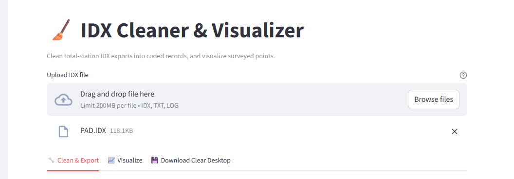
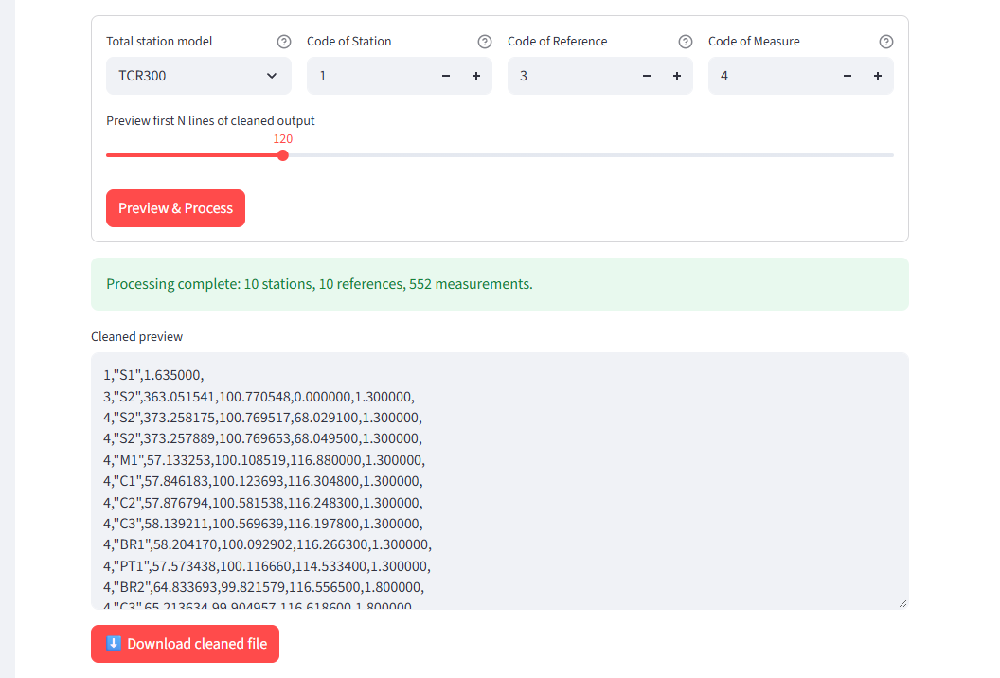
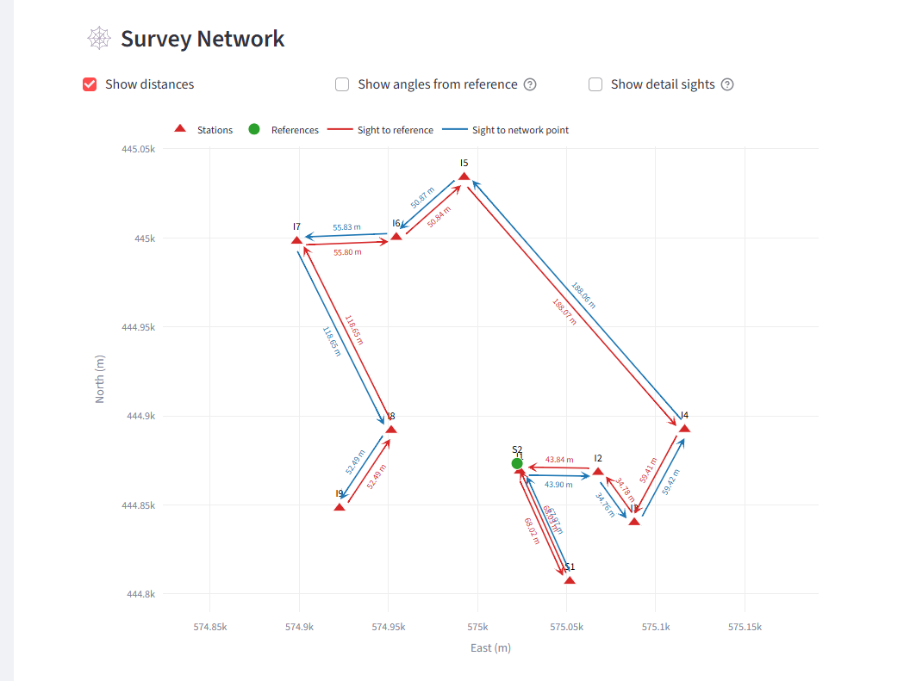
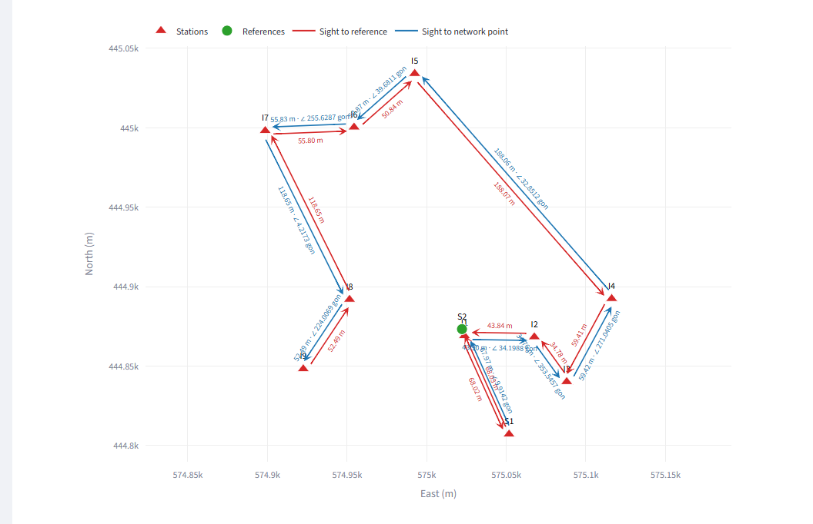
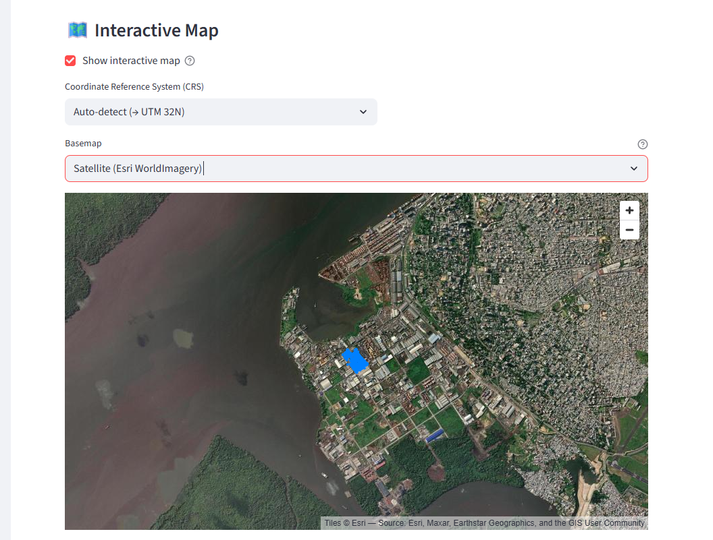
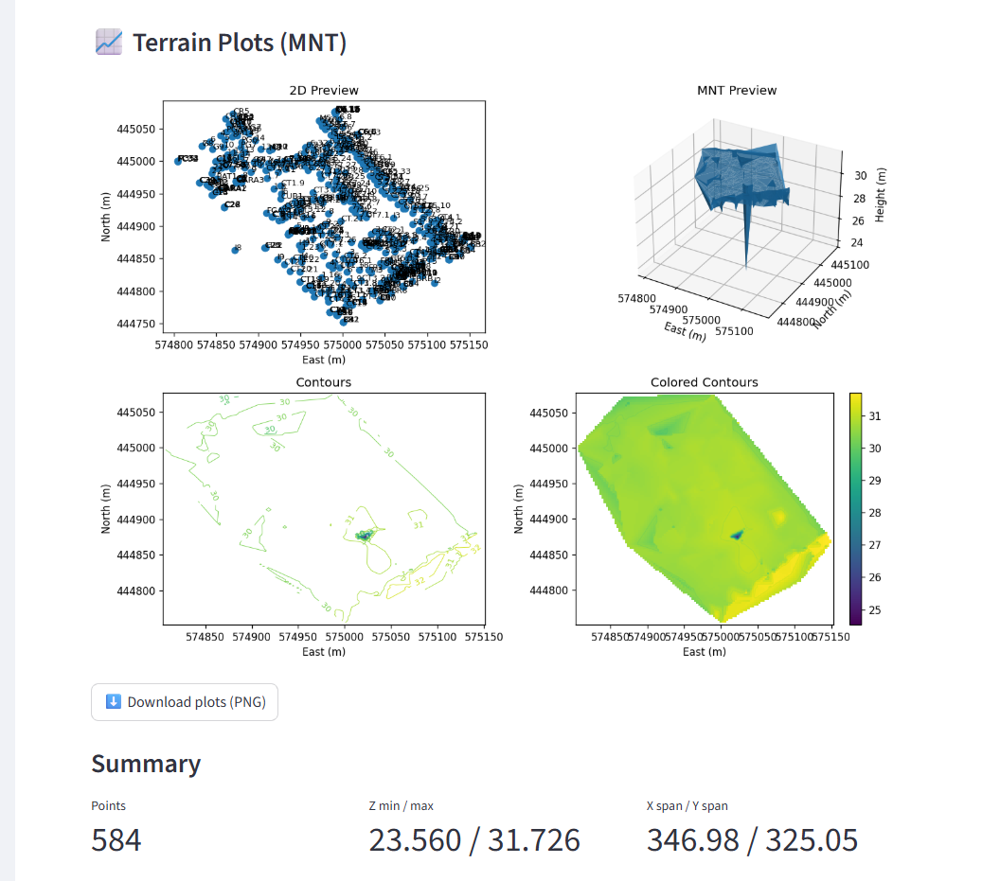

# Clear for Web

**Clear for Web** is a web application for land surveyors. It turns the raw **IDX** export of a
total station into a clean, coded measurement file, and lets you check the survey visually: the
station/reference **network**, the points on a **web map**, and **terrain plots (MNT)** of the
surveyed area.



<!-- help:start -->

## Quick start

1. **Upload** your IDX file at the top of the page (`.idx`, `.txt` or `.log`, up to 200 MB).
   The same file is used by every tab, so you only upload it once.
2. **🔧 Clean & Export**: choose the total station model, check the codes, click
   **Preview & Process**, then **Download cleaned file**.
3. **📈 Visualize**: click **Generate Visuals** to see the survey network, the interactive map
   and the terrain plots.

> **Try it with the sample data:** the screenshots in this guide were made with `PAD.IDX`
> from the `test_data` folder of the project.

## 🔧 Clean & Export



| Setting | What it does |
|---|---|
| **Total station model** | The instrument used for the survey. TCR300/400/700/800 exports are comma-separated; TS06plus/Builders exports are tab-separated. Both layouts are read automatically. |
| **Code of Station** (default `1`) | Code written in front of each station (instrument setup) record. |
| **Code of Reference** (default `3`) | Code written in front of the first sight after each setup, the backsight to the reference. |
| **Code of Measure** (default `4`) | Code written in front of every other measurement. |
| **Preview first N lines** | How many lines of the result to show in the preview box. The downloaded file always contains everything. |

Click **Preview & Process**. A green message reports how many stations, references and
measurements were found, and **Download cleaned file** saves the result as `<your file>_cleaned.txt`.
Open **Raw file preview** to look at the original file.

### Output format

Each line starts with its code, followed by comma-separated values:

```text
1,"S1",1.635000,                                   ← station: ID, instrument height
3,"S2",363.051541,100.770548,0.000000,1.300000,    ← reference: ID, Hz, Vz, slope distance, target height
4,"M1",57.133253,100.108519,116.880000,1.300000,   ← measure:   ID, Hz, Vz, slope distance, target height
```

- **Hz**: horizontal angle reading; **Vz**: zenith (vertical) angle. Both are in the unit of the
  file (gon for the sample data).
- **Slope distance** and **target (reflector) height** are in metres.

## 📈 Visualize

Click **Generate Visuals**. Tick **Annotate points with labels** first to show point names on the
2D plot and in the map tooltips. The tab has three sections.

### 1. 🕸️ Survey Network



The network shows where the instrument was set up and what was measured from each setup:

- **Red triangles** are stations (instrument setups); **green circles** are references that were
  never occupied as stations.
- **Arrows** point from the station toward the point it measured. **Red arrows** are sights to
  the setup's reference (backsight); **blue arrows** are sights to other stations or references.
- When a line was measured **in both directions** (forward and backward), the two arrows are
  drawn **side by side**, so each one stays visible.
- Each arrow is labelled with its **horizontal distance**, calculated as slope distance × sin(Vz).
  Repeated sights in the same direction are averaged.
- **Hover** over the middle of an arrow to see the horizontal distance, the Hz reading and the
  angle from the reference. Hover over a point to see its coordinates.
- **Scroll** to zoom, **drag** to pan, **double-click** to reset the view.

Options above the chart:

| Option | Effect |
|---|---|
| **Show distances** | Label each arrow with its horizontal distance. |
| **Show angles from reference** | Add the horizontal angle at the station, measured clockwise from the reference sight (∠, in the file's unit). |
| **Show detail sights** | Also draw the sights to detail (non-network) points as thin grey lines. |



Station and point coordinates come from the `POINTS` table of the IDX file. If a sight can't be
drawn because one of its points has no coordinates, it is listed under the chart.

### 2. 🗺️ Interactive Map



Tick **Show interactive map** to place the surveyed points on a basemap.

- **Coordinate Reference System (CRS)**: the system your coordinates are in. **Auto-detect** uses
  WGS84 longitude/latitude when the values look like degrees, otherwise UTM zone 32N. You can
  pick UTM 32N or 33N directly, or choose **Custom EPSG code…** and type any EPSG code (for
  example `32736`). If the points appear in the wrong place, the CRS is wrong.
- **Basemap**: **OpenStreetMap** streets or **Satellite** imagery (Esri World Imagery).
- Hover over a point to see its name, elevation and position.

### 3. 📈 Terrain Plots (MNT)



Four views of the surveyed terrain, built from every point with East, North and Elevation:

- **2D Preview**: the points in plan, with their names.
- **MNT Preview**: a 3D surface of the terrain.
- **Contours**: contour lines with height labels.
- **Colored Contours**: the terrain coloured by height.

Use **Grid resolution** in the sidebar (⚙️ Options) to make the contours smoother or coarser.
**Download plots (PNG)** saves the four plots as one image. The **Summary** gives the number of
points, the elevation range and the size of the area. The surface and contours need at least
3 points that are not on a straight line.

## 💾 Download Clear Desktop


Downloads the installer of **Clear**, the desktop version of the application.

## Troubleshooting

| Message or problem | What to check |
|---|---|
| *No station or measurement records were found* | The file must be a total-station IDX export with `SETUP` and `SLOPE` sections. A file that only contains coordinates has nothing to clean. |
| *No station setups with coordinates were found* | The network needs `SETUP` sections and coordinates for the stations in the `POINTS` table. |
| *Terrain plots unavailable* / map not available | The `POINTS` table has no points with East, North **and** Elevation. |
| Points appear in the wrong place on the map | Choose the right CRS, or enter your EPSG code under **Custom EPSG code…**. |
| Several stations drawn on top of each other | The file gives those stations the same coordinates. Check the station coordinates in the instrument. |
| Wrong distances or angles | Angles are read in the unit declared in the file (`ANGULAR GRADS`, `DEGREES` or `MIL`). DMS is not supported yet. |

<!-- help:end -->

## Running locally

Requirements: Python 3.12 (see `runtime.txt`).

```bash
python -m venv clear_venv
clear_venv\Scripts\activate          # Windows
# source clear_venv/bin/activate     # macOS / Linux
pip install -r requirements.txt
streamlit run main2.py
```

The app opens at <http://localhost:8501>.

## Project structure

| Path | Contents |
|---|---|
| `main2.py` | The Streamlit application: IDX parsing, cleaning, network, map, plots and user interface. |
| `requirements.txt` | Python dependencies. |
| `runtime.txt` | Python version used for deployment. |
| `test_data/` | Sample IDX files (`PAD.IDX`, `KIKOTE4.IDX`, `M_PONT.IDX`, `AKOK.IDX`, `F_PONT.IDX`). |
| `docs/screenshots/` | Screenshots used in this README and in the in-app Help tab. |

The **❓ Help** tab of the app shows the user guide part of this README (between the
`help:start` and `help:end` markers), so the two stay in sync.

## Contact

© Tangent Analytics. All rights reserved. Contact:
[tangent.anlytics.ca@gmail.com](mailto:tangent.anlytics.ca@gmail.com)
